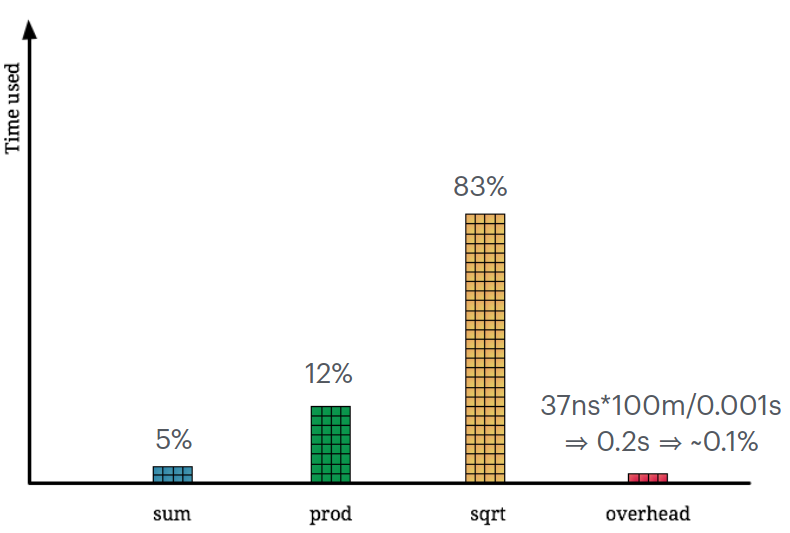

# Benchmarking & Profiling

- Current and future generation experiments are very CPU / storage hungry
- Heterogeneous environment: running on the grid, HEP software is faced with many computing hardware with different performance characteristics and operating environment.
- Caches always work in terms of cache lines: copies from / to the cache always happen in terms of cache-line size aligned chunks
- Key to performance: **measure**
- Compilers are smart
- STL containers are very powerful
- Model your expectations before you run a benchmark, not after!
- Exceptional improvements need exceptional validation!
- Benchmarking tools:
  - Catch2 / Google benchmark
  - macro is executed multiple times
  - One single execution = run or iteration
  - Multiple iterations = sample
  - Per benchmark execution, the number of iterations in a sample stays constant
  - Initial estimation of the result happens. Such estimation might warm up the caches.

- Memory usage is sometimes a stricter requirement than CPU usage.
- **Stack**: area of memory which is used to store (push) variables local to a given function
- **Stack-frame**: Information to handle function call
- **Callstack**: Nested functions add up one on top of the other
- Whenever a function returns, the frame gets "pop-ed" from the stack.
- External tools (like debuggers (**gdb**) or profilers) can be injected in the program flow to inspect the current callstack.
- The callstack gives us a precise location on where we are inside our program
- **Sampling profilers**: In practice, our programs have a repetitive behaviour, lasting very long. Periodically sampling every few milliseconds what is being run by the CPU we converge to the same time distribution while amortising the overhead

- **Memory profilers**: Help us also to improve correctness / finding leaks. Track memory usage by instrumenting malloc / free and related functions (e.g. **igprof**).
