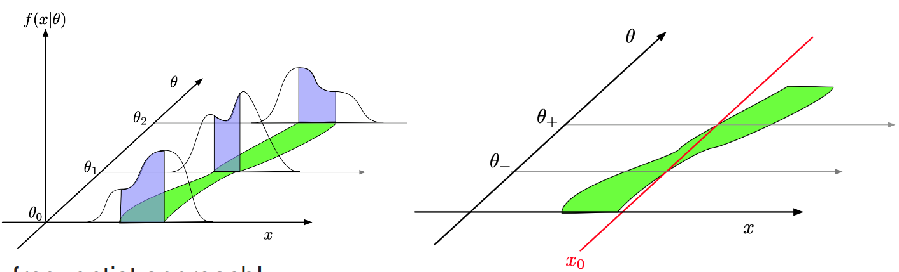

# DATA ANALYSIS

Data analysis is a process for obtaining raw data and converting it into information useful for decision-making by users.

**Central limit theorem**: no matter what the distributions of original variables may have been, their sum will be Gaussian in a large N limit

## MONTE CARLO METHODS

- use randomness to solve problems that might be deterministic in principle
- optimisation, numerical integration, generating draws from a PDF

MONTE CARLO WORKFLOW

- DEFINE A DOMAIN OF POSSIBLE INPUTS
- GENERATE INPUTS RANDOMLY FROM THE DOMAIN
- PERFORM A DETERMINISTIC COMPUTATION USING THE INPUTS
- AGGREGATE THE RESULTS OF THE INDIVIDUAL COMPUTATIONS INTO THE FINAL RESULT

Pseudo-random number generators create long runs (for example, millions of numbers long) with good random properties but eventually the sequence repeats

## PARAMETER ESTIMATION

- parameter estimator $\hat \theta(x)$

Good estimator

- **consistent**: converge to true value as data increases
- **unbiased**: $b = E(\hat \theta) - \theta^{true}$
- **efficient**: small variance
- **robust**: insensitive to assumptions of PDF

Statistic

- Any new random variable, defined as a function of a measured sample x
- A statistic used to estimate a parameter is called an estimator

Maximum likelihood method

- You determine the value of that makes the probability of the actual results obtained, {x1, ..., xN}, as large as it can possible be.
- consistent, asymptotically unbiased, efficient
- ML estimate is not the most likely value of parameter; it is the estimate that makes your data the most likely!
- Extended ML: parameters for PDF shape + normalization

Least squares method

- for gaussian data ML = LS

## CONFIDENCE INTERVALS

In addition to a “point estimate” of a parameter we should report an interval reflecting its statistical uncertainty

- Symmetric interval: equidistant from mean
- Shortest interval: minimize (x_up - x_lo)
- Central interval: integrate from bounds to x_lo/hi an equate to (1-C)/2
- Upper/lower limit: integrate to boundary (one sided)

$$
\ln L\left(\hat{\theta} \pm N \cdot \sigma_{\hat{\theta}}\right)=\ln L_{\max }-\frac{N^2}{2}
$$

### NEYMAN CONFIDENCE INTERVAL

## HYPOTHESIS TESTING

- discriminate between two or more hypotheses on the basis of the observed experimental data
- $P(x \in W | H_0) \leq \alpha$
- $\alpha$ - size / significance level
- critical / rejection region
- Type I error / type II error
- 
- To construct a test of a hypothesis $H_0$, we can ask what are the relevant alternatives for which one would like to have a high power
- **Wilk's thm**: As the sample size approaches $\infty$, the distribution of the NLL test statistic asymptotically approaches the chi-squared distribution under the null hypothesis $H_0$.
- P value
  $$ P(t \geq t_{obs}) = \int_{t_{obs}}^\infty dt \, g(t|H_0) $$
- probability to find $t$ in the region of equal and lesser compatibility with $H_0$ than the level of compatibility observed with actual data
- To protect against underfluctuations
  $$ \frac{P(t \geq t_{obs}| H_1)}{P(t \leq t_{obs} | H_0)} \geq 1-CL $$