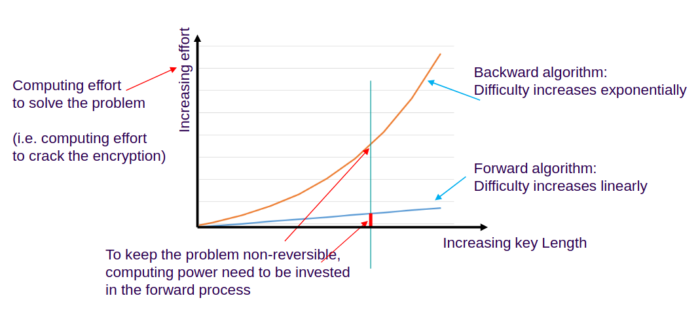
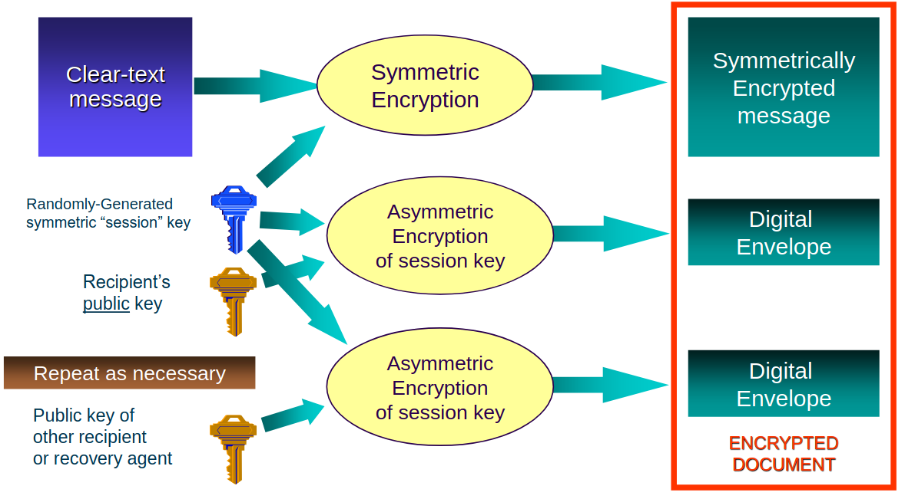
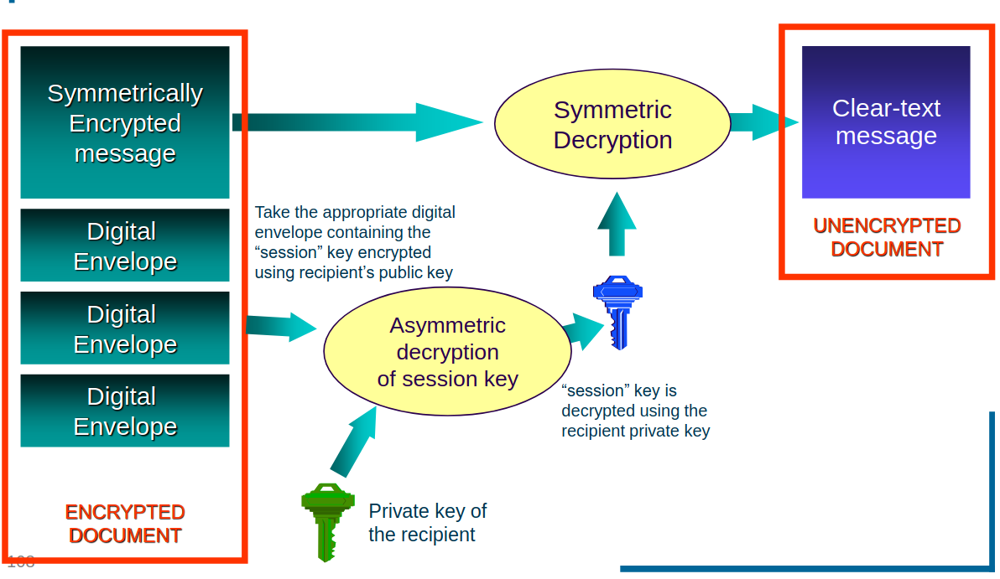
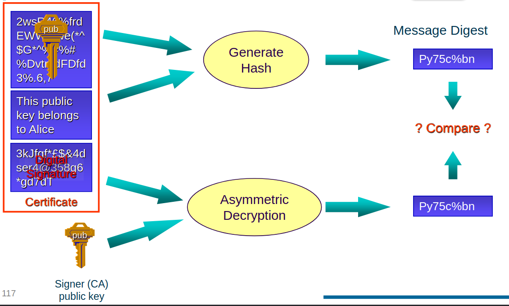
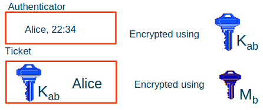

# Data Technologies

- Storage is one of the main pillars of computing
- Data management:
  - Data reliability, Access control, Data distribution
- Data pool metrics: Performance, Reliability, Cost

## Data Management Components

### Reliability

- probability to lose data
- reliability of service = reliability of disks
  - disk mirroring
  - **RAID**: Redundant Array of Inexpensive Disks

- Tapes:
  - Slow in random access mode
  - Inefficient for small files
  - Comparable cost per (peta)byte as hard disks
  - Fast in sequential access mode
  - Several orders of magnitude more reliable than disks
  - No power required to preserve the data
  - Less physical volume required per (peta)byte

- **RAID**
  - 0: Disk striping; split data, less reliable, faster
  - 1: Disk mirroring; mirror data
  - 5: parity information distributed across disks; reconstruct in case of loss
  - 6: Reed–Solomon error correction
- **error correction**
  - redundant information to enable rebuilding data
  - Reed–Solomon error correction:
    - oversampling, `m` points needed, `m+n` stored
- **error detection**
  - `n` corrupted values -> detect error
  - `<n` corrupted values -> correct error
  - if checksum: can correct `<=n` corrupted values
- **reliability**
  - hardware, RAID type, number of disks
  - RAID disk based
  - solution: distributed chunks/blocks of data
  - chunk size s, nr chunks s, sets of chunks m, additional chunks n
    - for any m chunks among m+n -> reconstruct missing n
    - immune to loss of n chunks
    - additional storage n/(n+m)
    - parallelized reading for m chunks
- **corruptions**
  - broken files: hash
  - broken chunks: chunk hash
  - identifies broken chunks
- **LDPC (Low Density Parity Check)**

- **service operations**
  - Ensure that there is enough spare storage to cope with: hardware failure / planned replacement
  - Asynchronous interventions only

### Access control and security

#### Cyptography

- Confidentiality (nobody can get knowledge), Integrity (not been modified), Authenticity (verify that you are talking to the entity you think you are)
- **symmetric encryption**
  - encript / decript with same key
  - cracking: varify that decryption is correct
- **asymmetric encription**
  - encript / decript with different keys (public /private)
  - keys are interchangable
  - cracking: heavy math operation, difficult to reverse (unless with hint - private key)
  - 
- **data integrity**
  - avoid data corruption
  - **cryptographic hash**
    - efficient operation returning fixed size string
    - not perfect: data space is infinite, hash size fixed
    - not safe against intentional modifications -> encrypt it: **digital signiture**
- **digital signiture**
  - guarantee the integrity of our data if the attacker is able to modify both data and the hash
  - Digital signed documents are NOT encrypted
    - No knowledge of any key is necessary to read the document
  - Anyone can verify the integrity and the authenticity of the document ( knowledge of the public key of the signatory is necessary)
  - If the document is modified, it needs to be signed again (Knowledge of the private key required)
  - public key of signatory -> certificate
- **hybrid encription** (data storage)
  - 
  - 
- **Cryptography Security**
  - Kerckhoff’s Principle
    - The security of the encryption scheme must depend only on the secrecy of the key and not on the secrecy of the algorithms
  - algorithms should be known and published
  - design and key length matter

#### Authentication

- need a third party who can guarantee the other's key validity
- PKI = Public Key Infrastructure
  - Public Key Infrastructure provides the technologies to enable practical distribution of public keys
  - uses certificates
- Kerberos

**Certificates**

  - A public key + Information about the entity that is being certified to own that public key
  - Digitally signed by someone trusted from which you have the public key
  - Verifying a Certificate: 
- Authentication with Certificates
  - Owning a Certificate does not imply you are authenticated
  - Bob gets Alice’s certificate
  - He verifies its digital signature
  - Bob challenges Alice to encrypt for him a random phrase he generated (“I like green tables with flowers” - nonce)
  - Alice has (if she is the real Alice) the private key that matches the certificate, so she responds (“deRf35D^&#dvYr8^*$@dff”)
  - Bob decrypts this with the public key he has in the certificate (which he trusts) and if it matches the phrase he just generated for the challenge then it must really be Alice herself
- Certificate Key Hierarchy
  - Every time the private key is used to encrypt something, it is somehow indirectly exposed.
  - Key hierarchies and proxy certificates are used
- Certificate revocation
  - (Private) keys get compromised
- Certificate Renewal
  - Certificate authority has two options
    - create a new certificate with a new expiration date using the same public key
    - force the new certificate to have a different public key

**Kerberos**

- relies on symmetrical cryptographic algorithms
- Key Distribution Center (KDC) -- trusted, secret master key is different for each user
- KDC: distribute a unique session key to each pair of users
- Kerberos authentification:
  - Alice: Ticket (name + time) encripted with shared session key +  (shared session key + name) encripted with Bobs key
  - 
  - Bob: decrypts ticket and sends timestamp to Alice, encrypted with session key
  - -> secure connection with session key
- Additional security: **ticket granting ticket** (TGT)
  - TGT contains the session key to be used by Alice in her communications with the KDC throughout the day

#### Authorization

- Access control list (ACL): right, subject, resource
- ACL must be supported on every node
- group / role support

### Accounting

- A good accounting is a valid alternative to a strict authorization scheme

### Scalability
#### Cloud storage

- Highly scalable
- Simple interfaces to access storage

- Simple
  - Single pool where all data go. Reliable, Fast and outsourced.
  - Unique quality of service
- can become expensive or inefficient
- **bucket**: fast/scalable indexing for cloud storage

**Distributed hash table**

- Empowers scalability. Storage spans multiple clusters / multiple data centers and is federated under a unique name space
- **Hash table**
  - data structure that uses a hash function to map keys (ex: a person's name) to their values (ex: the telephone number).
  - hash function is used to transform the key into the index (the hash)
  - perfect scalability: cost (number of instructions) for a lookup is independent of the number of elements stored in the table.
  - Collisions: finite probability of mapping to same hash
- **Consistent hashing**: Choose a hash function that preserve the key hashes when the table is resized. Minimal data movement when servers added or removed
- **Distributed hash table**:
  - cloud storage uses **distributed hash tables** to locate objects
  - keyspace partitioning scheme distributes hash values among the multiple servers
  - overlay network connects the nodes, allowing any of them to route a data request (put, get) to the server owning any key in the keyspace.
  - Must be able to add / remove nodes: Consistent Hashing
  - Reliability and Fault Tolerance can be implemented by replicating values (or error correction information) on n adjacent nodes.
  - Highly scalable, reading and writing data is independent of the size of the hash table.
  - Partitioning:
    - Range partitioning requires a table that maps objects into storage instances
    - Hash partitioning requires all data to be moved when adding a new instance, unless you use consistent hashing

#### Block storage

- Block storage is a level of abstraction for storage organized in “blocks”, where a block is data having a nominal (fixed) length (a block size).
- When the size exceeds one block, data is stored in multiple blocks.
- More effective load balancing of storage
- Allows implementation of error correction algorithms
- Performance is proportional to the resources deployed and less dependent from access patterns