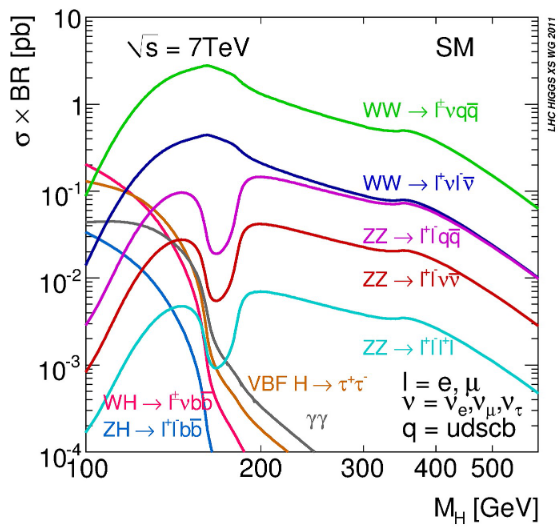

# Introduction to Physics Computing

- mass ~ Yukawa coupling

## Symmetry
- symmetry <--> consevation laws
- symmetry breaking -> physics phenomena

## Higgs mechanism / EW symmetry breaking
- mass ~ Higgs coupling

## Higgs production

- $H \to \gamma \gamma$
  - rare / low masses
- $H \to W W^*$
- $H \to Z Z^*$
  - 4l: olden channel
- $H \to \tau \tau$
  - good S/B; Higgs properties

## Computing
- design event rate: 40MHz
- recording rate: up tp O(1) kHz
- event size O(1) MB
- Online computing: discarding data
  - Trigger: event selection
    - essential features: high pT, high calorimeter deposit
  - Data acquisition: build events from fragments
  - Monitoring
  - Control
- offline computing: compression of data

## ATLAS detector
- Inner detector
  - Momentum and position of charged particles
- Electromagnetic calorimeter
  - Energy of photons, electrons and positrons
- Hadron calorimeter
  - Energy of charged and neutral hadrons
- Muon system
  - Momentum and position of muons

- Trigger:
  - Level 1: calorimeters + muon
  - Level 2: + inner detector + ROIs
  - EF: same as offline reconstruction