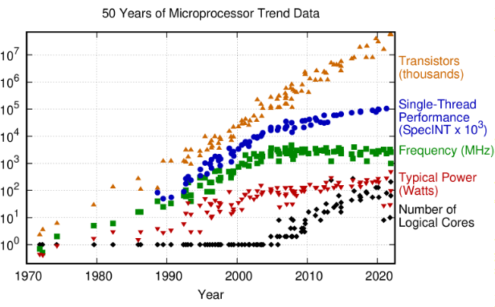
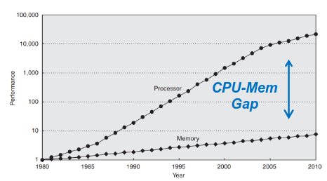
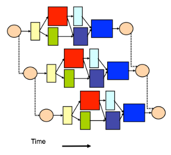

# Software Design in the Many-Cores era

- Power wall
- 
- ILP (Instruction-Level Parallelism) wall
- Memory Wall
  - 
  - Latency in memory access
  - Help: Larger and faster cache
- Grow by combining simpler processing units
- CPU = core (= transistors for logical operations) + memory
- How is Parallelism Achieved?
  - implicit vs. explicit
  - Supercomputer design tailored for High-Performance Computing
  - Explicit low-level parallelism dominates (OMPI, OpenMP inside a node)
- Physics Challenges
  - pile-up (luminosity)
    - making it hard to run many simultaneous jobs on a single computer (Independent jobs do not share memory!)

- Introduce Concurrency
  - Schedule the algorithms according to the DAG (directed acyclic graph)

- Is Parallelisation Worth It?
  - **Amdahl’s Law**: 
    $$speedup = \frac{1}{(1-p) + p/n}$$
    - n - cores, p - parallel portion
    - **Strong scaling**: A problem of a fixed size is processed by an increasing number of processors
  - **Gustafson’s Law** 
    $$speedup = 1-p + pn$$
    - **Weak scaling**: Every processor has a specified amount of work to do, and when adding processors, we also add work

- Parallelisation can be exploited in multiple ways:
  - **Data Parallelism**: application of the same transformation to multiple pieces of data (multiply array by nr)
  - **Task Parallelism** (HEP approach): partition of load in small work baskets consumed by a pool of resources (calculate mean, ...)
  - mixing is key

- Complications
  - DAG not completely known
  - Shared states rarely safe
  - Algorithms not thread-safe
  - External libraries not thread safe
- Solutions
  - The DAG must be “fixed” by changing the existing code
  - Shared states are replaced by task-local data, avoid locks!
  - If an algorithm requires a non-thread safe resource, it has to ‘reserve’ it beforehand

- Scheduling Directions
  - **On demand / backward scheduling**: Start with the last algorithms
  - **Data driven / forward scheduling**: Start with the first algorithms
  - **Global view**: Analyse the entire DAG

- The data layout and access pattern are essential for performance: **Data Oriented Design**

## Concurrency

- asynchronous execution of the calculation, retrieval of the result at a later stage
- Lazy evaluation: Execute a function concurrently in a separate thread or on demand when the result is needed (lazily)
- std::async

## Threads

- **Process**: isolated instance of a program, with its own space in (virtual) memory, can have multiple threads
- **Thread**: light-weight process within a process, sharing the memory with the other threads living in the same process
- The kernel manages the existing threads, scheduling them to the available resources
(CPUs)
  - There can be more threads in a single process than cores in the machine! (oversubscribing)
- **Stack**: The stack is a collection of stack frames. It grows whenever a new function is called. “**Thread private**”.
- **Heap**: Dynamic memory (e.g., requested with “new”). Threads can communicate via the heap.
- Threads have their **own stack**, but they share a **common heap**
- Thread pool: ensemble of worker threads which are initialised once, consuming work from a work queue to which elements of work (tasks) can be added

## Synchronisation: design principles, replication, atomics, transactions and locks

- Fastest way to share data: access the same shared memory
  - One of the advantages of threads
- Parallel memory access: possible race conditions
- *Operative definition*: An entity which cannot run w/o issues linked to parallel execution is said to be **thread-unsafe** (the contrary is **thread-safe**)
- Two expression evaluations **conflict** if one of them modifies a memory location and the other one accesses or modifies the same memory location.
- The execution of a program contains a **data race** if it contains two conflicting actions in different threads, at least one of which is not atomic, and neither happens before the other. Any such data race results in undefined behaviour.
- **Functional Programming Style**
  - *Operative definition*: computation as evaluation of functions the result of which depends only on the input values and not the program state.
  - Can avoid lots of headaches typical of parallel programming (no side effects, no input modification, return new values). Decompose operations in functions, percolate the information through their arguments
- **Thread Local Storage (TLS)**
  - “private heap” common to all functions executed in one thread
  - Analogies with multi-process approach
- **Atomic Operations**
  - operation seen as non-splittable by other threads
  - operations seen as a single step by all threads: no race conditions are possible
- **Locks and Mutexes**
  - Use case: detect condition (concurrently) → modify memory (once)
  - Locks should be avoided
  - Scoped Locks: the Proper Way
    - Construct an object which lives in the scope to be locked
    - When the scope is left, the object is destroyed and the lock is released
  - Pathologic behaviours of Locks: Deadlock, Convoying, Priority inversion, Lock based entities do not compose
  - Hold locks for the smallest amount of time possible

## Static code analysis

- Analysing the source code before compiling and running to automatically find bugs
- LLVM / Clang
- The static analyser is part of the clang frontend
- examine the program code on two levels:
  - Abstract Syntax Tree (AST)
  - Symbolic Execution: Every possible path through the program is explored and validated

## Understanding and Debugging - GDB

- GDB: The GNU Project Debugger
  - GDB is an interactive command line tool which can “see”:
    - Within a program during its execution
    - A posteriori, what a program was doing when it crashed
  - No recompilation needed
  - Stop the execution at some specified point
  - Thread aware: e.g. Stop threads, switch among them
- Debugging Symbols
  - The compiler does not automatically bring the names of the symbols in the executables and libraries
  - **compile with -g flag**
  - Do not slow down the program!
  - Do not increase its memory footprint!
  - Do make binaries bigger (more disk space needed)!
- By default GDB stops all threads simultaneously if a breakpoint is reached (so called “stop mode”). It allows also to stop the thread where the breakpoint was reached and let the others proceed (“non-stop mode”).
- You can “attach” gdb to a running process: `gdb \<PID\>`
- Access crashed program state: `gdb program core-file`
- Helgrind and DRD (part of Valgrind): Detection of potential thread unsafe operations, lock ordering problems

## Serial control flow patterns

- **sequence**:
  - ordered list of tasks/commands to be carried out in a given order, one task executed at a time
- **selection**:
  - a and b depend on c, only either a or b executed
- **iteration**:
  - certain operation executed while condition is true
  - loop carried dependency: iterations depend on each other

## Parallel patterns

- **map**
  - Apply the same function on all elements of a collection in parallel
  - requires: no loop-carried dependency, function is pure (no side effects)
- **partition**
  - custom split of the collection into subcollections or chunks
- **reduce**
  - combines the elements of a collection into a single result using a combiner function
  - c++: `std::reduce`
  - requires: No loop-carried dependency apart from the combined result, Combiner function is associative (beware of floating point precision), commutative functions beneficial
- **scan**
  - iteration pattern with more relaxed boundary conditions
  - Result of element n depends on n-1
  - Successor function is associative

- **map-reduce**: `histo = events.map(fillHist).reduce(mergeHist)`

- **pipeline**: sequence of operations with producer-consumer relationship, speedup: Amdahls law

- **superscalar sequence**: Split work into several tasks and define their data dependencies; **concurrent HEP data processing frameworks**

- **side-effects**
  - triggered when a computation modifies some shared state outside of its local environment
  - every non thread-safe resource is an issue
  - Side-effect free resources are the ideal solution

## C++ syntax

- modern c++ sytanx: `auto`, ranged based loops
- c++ lambdas: `[global dependencies (= for all)] ( args ) { body };`
