# Introduction to Machine Learning

reference [here](UnderstandingDeepLearning_08_28_24_C.pdf)

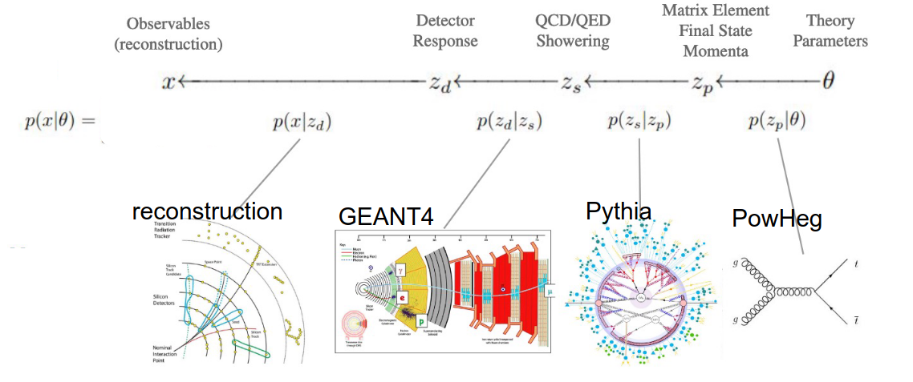

 Approximate p(x|θ) = ∫p(x, z|θ) dz

- AI: systems that simulate intelligent behavior e.g. via rules,
reasoning, symbol manipulation
- ML: subset of AI that learns to make decisions or predictions
by fitting mathematical models to observed data.
- DL: type of machine learning model, that aims at complex
pipelines, work on low-level data (e.g. pixels)

- Learning = search through a family of functions to let the data guide you to find the best one
- Easiest if you have a labeled data set where the input-output relation is known to train and validate
- Assume that all data comes from same underlying distribution (independent, identical, distributed)
- **Loss**: performance measure to quantify what ”best” means: “loss”, “risk”, “cost” function

Learning framework:

- Collect and prepare data to be consumed by the machine
- Define the task (objective)
- Choose search space of possible functions (algorithms) aka “hypothesis set”
- Define what “good” means, i.e. a performance measure
- Provide an optimising algorithm to update functions, i.e. change hypothesis
- Decide when to stop and to define the final hypothesis (function)

Supervised learning: mapping from input data to an output prediction

## Neural nets

- Build complexity by composing very simple building blocks
- Neural networks with a single hidden layer are universal function approximators
- Deep networks can generate complex patterns with much fewer parameters
- Bias: the loss L(fmin) of the overall best function f ∈ H
- restrict the “hypothesis set” of functions to perform the task
- “inductive bias”: constrain on the hypothesis set by adjusting the search space

## Empirical risk minimization

- interested in the expected performance of the algorithm on future data
- 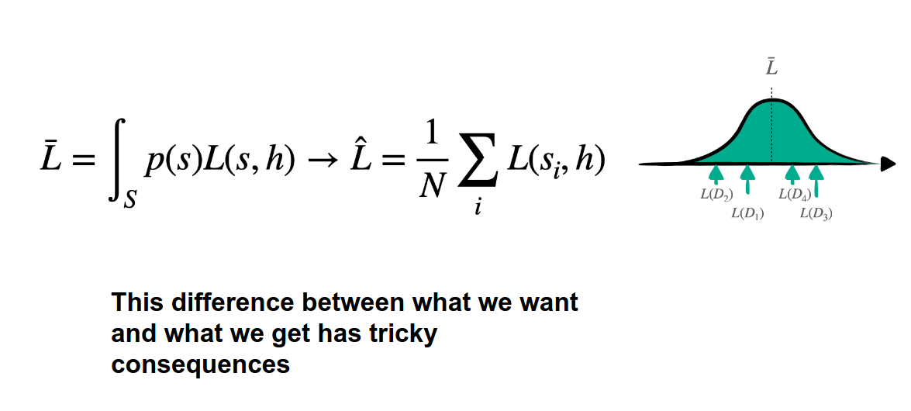
- 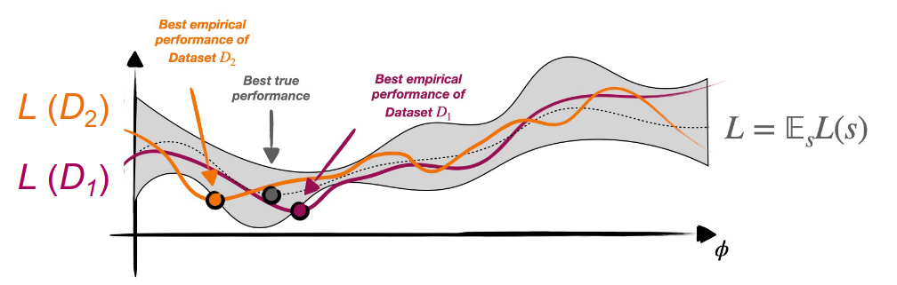
- Variance: spread of the loss of h* in H
  - 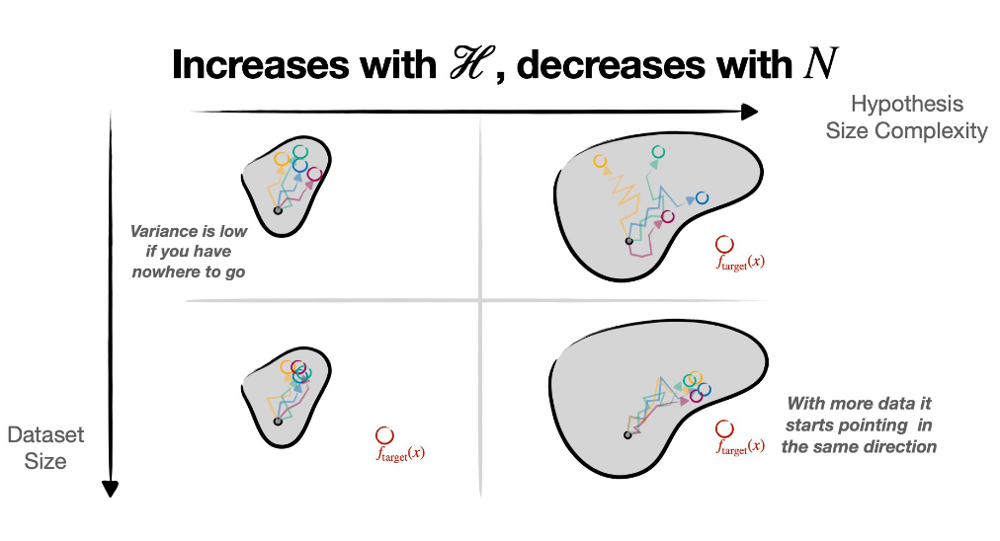
- Bias: offset of the loss of h* with respect to the true loss
- Bias-Variance tradeoff:
  - 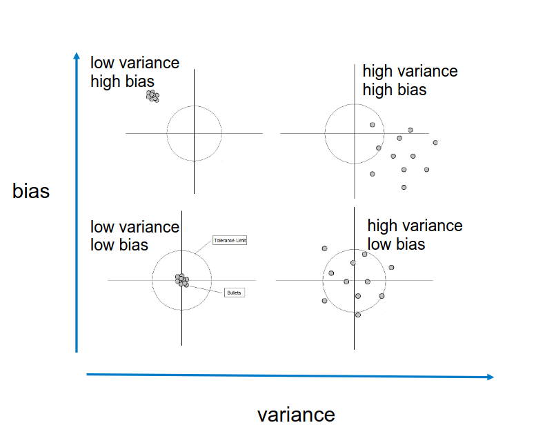
  - 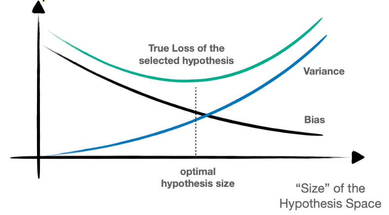
  - 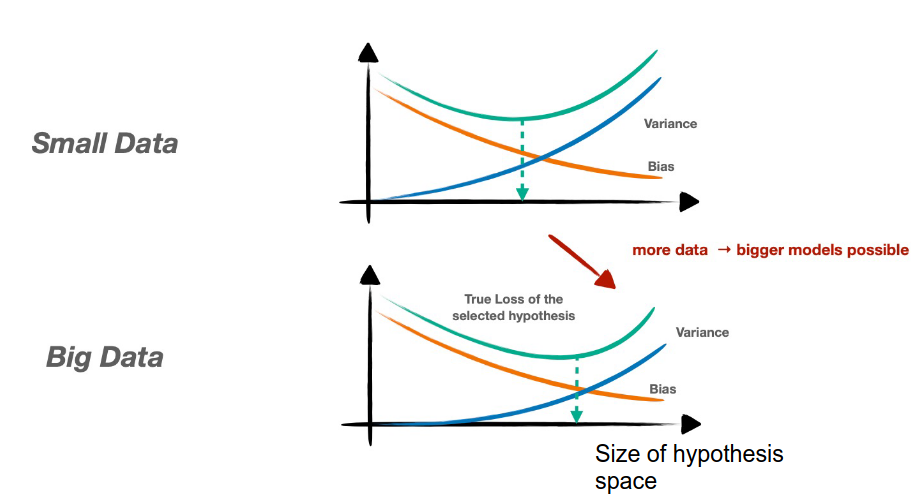

## Iterative Optimisation

Gradient descent

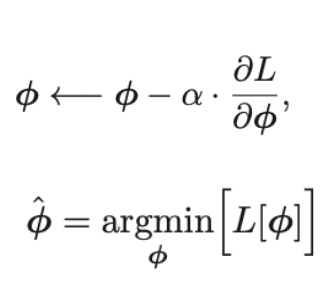

- $\alpha$ -- learning rate
- Stochastic gradient descent: Evaluating the loss on a small “mini-batch” instead of the full data
- Adapting the learning rate dynamically (ADAM optimizer)

**Backpropagation**

- 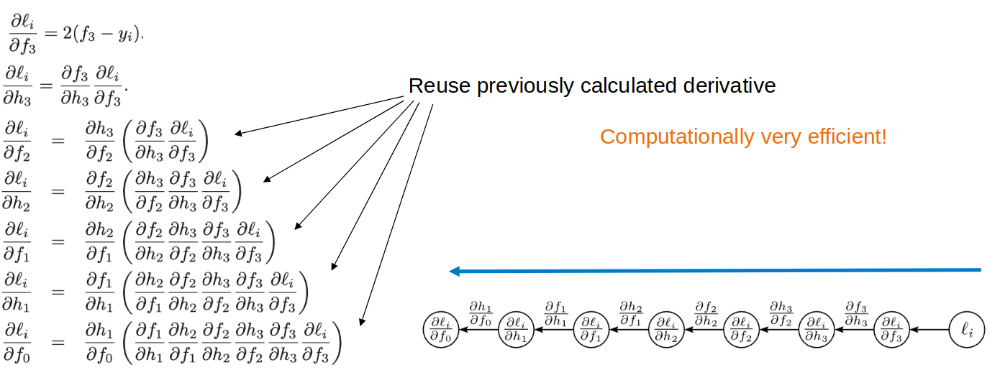
- super compute efficient but not memory efficient

Vanishing and exploding gradients

**Inductive Bias**

remove irrelevant function space

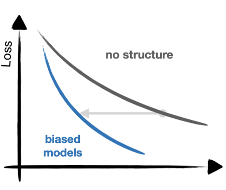

**CNN**

$$F(x) = \int f(x - y) g(y) dy$$

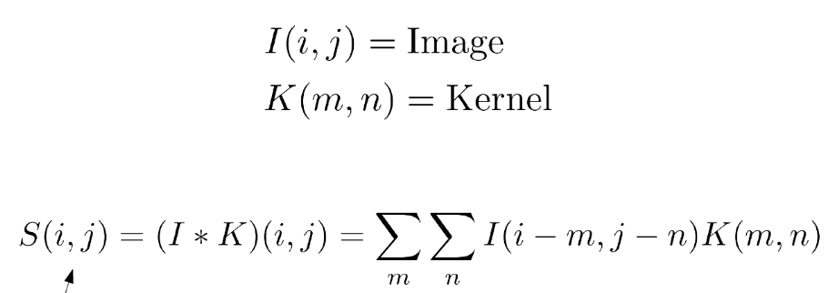

- shared weights
- pooling: combine pixels (max / average)
- downsampling: less nodes in subsequent layer
- padding: pad image

## Saliency Maps

- Interpret model for given sample(image)
- Gradients with respect to pixels
- Saliency map = complete set of gradients

## Visualisation of high dimensional data

- Reproduce distances in higher dimensional space as closely as possible in low dimensional “map”
- T-distributed Stochastic Neighbour Embdding: Define pairwise probability distribution that depends on distance in high dimensional spaces

A convolution with a stride greater than one may ignore parts of the
signal

## autoencoders

This modeling consists of finding “meaningful degrees of freedom” that describe the signal, and are of lesser dimension.

Dimension reduction can be achieved with an autoencoder composed of an
encoder f from the original space 𝒳  to a latent space ℱ , and a decoder g to
map back to 𝒳.

Sample the latent space: we can assess the generative capabilities of the decoder g by introducing a [simple] density model qZ over the latent space ℱ , sample there, and map the samples into the image space 𝒳 with g.