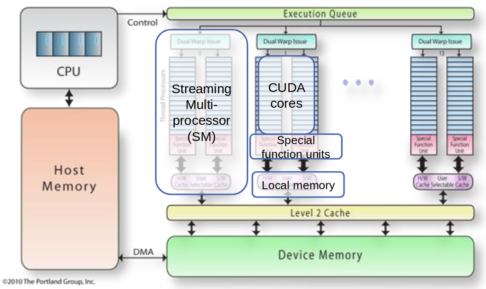
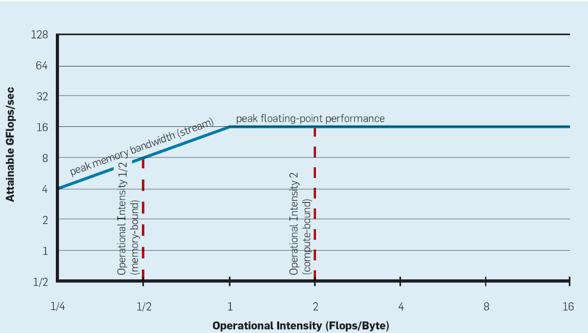

# SUSTAINABLE COMPUTING

Stakeholders

- Developers and users
  - Improve the energy efficiency of their own codes
- System integrators
  - Offer the right mix of resources for the application developers
  - efficient hardware
- System operators
  - Ensure efficient scheduling

- Current Goal: Maximize Throughput (Workloads)
- Constraints: Budget, System Footprint/Weight; CoolingCapacity; PowerSupply; ...
  - +Carbon Budget

- Extend Lifetime, Reuse, and Recycle
  - System Lifetime: Typically 4-6 years
- Reuse & Recycle
  - Reduce carbon emissions caused by disposal & production

- Operation
  - Shared resources, Location shifting, Time/Peak shifting

Developers & users

- Measure/Quantify

- Modern (and future) systems are parallel and heterogeneous
- Systems are characterized by peak performance
- All applications want more performance

Performance metrics

- Speed-up: how much faster do we get with new machines, algorithms, ...
- Efficiency: how efficient are we in getting performance
- Energy efficiency: how energy efficient are we in getting performance
- Utilization: how efficient are we utilizing our resources

- High-performance computing -> High-efficiency computing
- nonfunctional requirement
- We assume computing waste is a consequence of underutilized resources.

Reducing waste in computing

- Raise awareness: Performance analysis, modeling
- Improve efficiency: Performance optimization, resource sharing

Supercomputers: extremely large computer systems (Top500, Green500)

- All the processors in a supercomputer can perform computations at the same time => parallel computing
- max vs peak: memory bandwidth limitation

Parallel System Models

- Shared Memory: Multiple compute nodes, One single shared address space
- Distributed Memory: Multiple compute nodes, Multiple, local (disjoint) address spaces, Virtual shared memory: software/hardware layer “emulates” shared memory
- Hybrids

- Peak performance = sum of capabilities of all machines
- Scaling options: More nodes (scale out), More powerful nodes (scale up)
- Limitations: Memory, I/O, networking bottlenecks, Load-imbalance, Non-uniform behaviour, Programmability
- Sustainablity:
  - Low performance => Low utilization => Low efficiency
  - Inefficient resource reservation => Low efficiency
  - Inefficient parallel application design affects all levels in terms of efficiency and sustainability!

Inefficient parallel application design = BAD

**Systems performance “metrics”**

- Clock frequency [GHz] = absolute hardware speed
- Operational speed [GFLOPs]: Operations per second
- Memory bandwidth [GB/s]
- Power [Watt]
- FLOP/Byte, FLOP/Watt, ...

**CPU**

- Computations are executed by the ALU (arithmetic logical unit), ALU runs at its own “clock speed” / frequency
- scale: faster/smarter ALU, faster CPUs, Multiple cores
- Unused => low efficiency => waste!
- Parallelism
  - Instruction-level parallelism (hardware)
  - SIMD (Single Instruction/Multiple Data) parallelism = data parallelism
  - Multi-Core parallelism ~ task/data parallelism

**GPU**

- Parallelism (Programmer’s intervention!)
  - Data parallelism
  - Task parallelism is “emulated”
  - Heterogeneous computing

**Theoretical peak performance**

- Throughput[GFLOP/s] = chips * cores * vectorWidth * FLOPs/cycle * clockFrequency
- vectorWidth: only when vectorizing
- Bandwidth[GB/s] = memory bus frequency * bits per cycle * bus width
- Peak performance: Balance[FLOPS/byte] = Throughput / Bandwidth

## Memory

- Memory operations are slow!
- Lots of memory traffic => CPUs idle => waste!

### Memory hierarchy and caches

**Cache**: A smaller, faster storage device that acts as a staging area for a
subset of the data in a larger, slower device.

**Memory hierarchy**: Multiple layers of memory, from small & fast (lower levels) to large & slow (higher levels)

**Application arithmetic (operational) intensity**

The number of arithmetic (floating point) operations per byte of memory that is
accessed

“A multi-/many-core processor is a device built to turn a compute-intensive application into a memory-intensive one”

**Attainable performance**

Arithmetic Intensity (AI) -- program dependent

Attainable GFlops/sec = min(Peak Floating-Point Performance, Peak Memory Bandwidth * Arithmetic Intensity)

The Roofline model

## Summary

- Systems scale-up (more machinery in the box) and scale-out (increasingly large (possibly distributed) clusters)
- Increase efficiency: Assess feasible performance and aim to reach it, Maximize utilization of hardware
- Most tool targets: Benchmarking Performance analysis & predicting, Upper bounds estimates, Bottlenecks